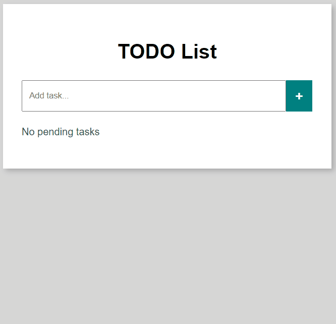

# Javascript Projects - TodoList

Crea una aplicación que nos permita añadir tareas, editar y eliminarlas. Todo el mundo necesita una ayuda para recordar todas esas tareas que necesitamos hacer día a día.

Para este proyecto necesitaremos un fichero html, un fichero js y una hoja de estilos. La estructura de nuestro proyecto será la siguiente:

    index.html
    main.js
    styles.css

Como podéis observar en el código de nuestro HTML hemos anidado nuestra aplicación en diferentes elementos para identificar el título, el contenedor principal, el contenedor del formulario de búsqueda y creación de tareas, y un listado donde nos irán apareciendo cada una de las que vayamos creando.

Adicionalmente hemos anidado el texto "All tasks are completed" en un 
 para hacerlo desaparecer una vez exista mínimo una tarea visible.

Fichero index.HTML:

<!DOCTYPE html>
<html lang="en">
<head>
    <meta charset="UTF-8">
    <meta http-equiv="X-UA-Compatible" content="IE=edge">
    <meta name="viewport" content="width=device-width, initial-scale=1.0">
    <title>TODO list</title>
    <link rel="stylesheet" href="./styles.css">
</head>
<body>
    

        <h1>TODO List</h1>
        

            <form>
                <input type="text" placeholder="Add task...">
                <button class="btn-add">+</button>
            </form>
        

        

            <ul>
                
            </ul>
        

        

            
All tasks are completed

        

    
 
    
</body>
</html>

Fichero styles.css:

body {
    margin: 0;
    padding: 0;
    font-size: 16px;
    font-family: Arial, Helvetica, sans-serif;
    line-height: 1.5;
    background-color: rgb(214, 214, 214);
    color: white;
  }
  
  h1 {
    text-align: center;
    color: rgb(0, 0, 0);
  }
  
  .container {
    margin-top: 30px;
    margin-bottom: 30px;
    width: 30%;
    margin-left: auto;
    margin-right: auto;
    background-color: white;
    padding: 30px;
    box-shadow: 4px 4px 8px rgba(0, 0, 0, 0.2);
  }
  
  .search {
    margin-left: auto;
    margin-right: auto;
    width: 100%;
  }
  
  form {
    display: flex;
  }
  
  input {
    padding: 15px 10px;
    outline: none;
    width: 400px;
  }
  
  .li-container {
    background-color: white;
    width: 100%;
    color: darkslategray;
    margin-top: 20px;
  }
  
  ul {
    padding: 0;
  }
  
  li {
    list-style: none;
    background-color: lightgray;
    border-radius: 10px;
    margin-top: 15px;
    display: flex;
  }
  
  li p {
    margin: 0;
    padding: 15px;
    width: 100%;
  }
  
  .btn-delete {
    margin-left: auto;
    border: none;
    background-color: #e31746;
    color: white;
    font-weight: bold;
    padding: 5px 10px;
    outline: none;
    border-top-right-radius: 10px;
    border-bottom-right-radius: 10px;
    width: 10%;
    font-size: 1.2em;
  }
  
  .btn-delete:hover {
    cursor: pointer;
    background-color: lightseagreen;
  }
  
  .btn-add {
    padding: 5px 15px;
    border: none;
    color: white;
    font-family: fantasy;
    background-color: teal;
    font-size: 1.4rem;
    outline: none;
  }
  
  .btn-add:hover {
    cursor: pointer;
    background-color: darkcyan;
  }
  
  .empty {
    color: darkslategrey;
  }

Ahora el reto está en vuestras manos dándole la funcionalidad apropiada a este TODO List a través del fichero main.js.

La pautas que tenéis que seguir son las siguientes:

    - Lo primero que hay que hacer es recuperar los elementos de nuestra página, ya sea el input, el botón, la lista e incluso el campo que queremos hacer desaparecer.
    - Una vez tengamos todos los elementos capturados tendremos que darle funcionalidad al botón y crear un elemento <li> por cada texto introducido en nuestro input (de ahí que en index.html hubiera una lista vacía). Esto se puede hacer de diferentes formas y recomendamos que controléis "errores" como el no permitir capturar una tarea sin texto.
    - A estas tareas hay que adjuntarles un botón de borrado que nos elimine cada una de las tareas.

Si todo ha ido correctamente os tendría que aparecer en pantalla una aplicación similar a esta:

Recomendamos jugar con el estilos, con diferentes funcionalidades, enviar los elementos completados a un array distinto en vez de eliminarlos y mostrarlos por pantalla y cualquier vuelta que le queráis dar a esta sencilla aplicación.

Además de esto, y para asimilar conceptos, podéis utilizar los identificadores y elementos de HTML que queráis siempre y cuando la lógica y el comportamiento de la aplicación sea efectivo y coherente.
